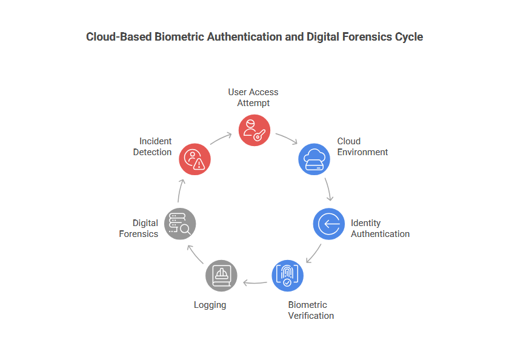
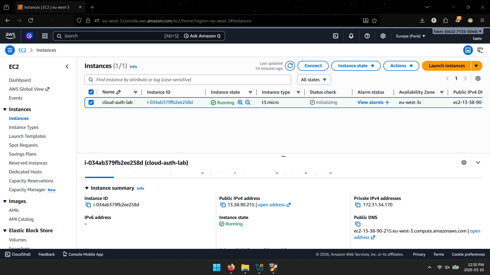
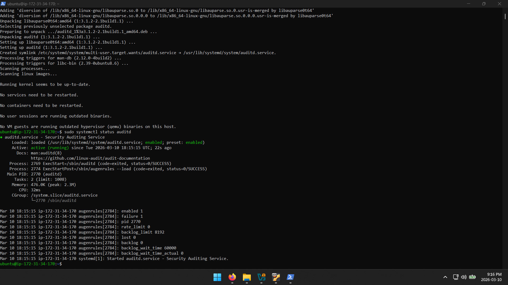
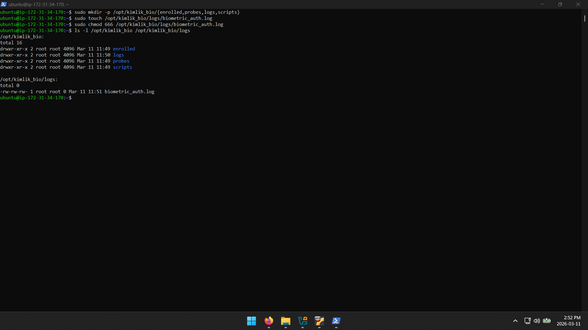
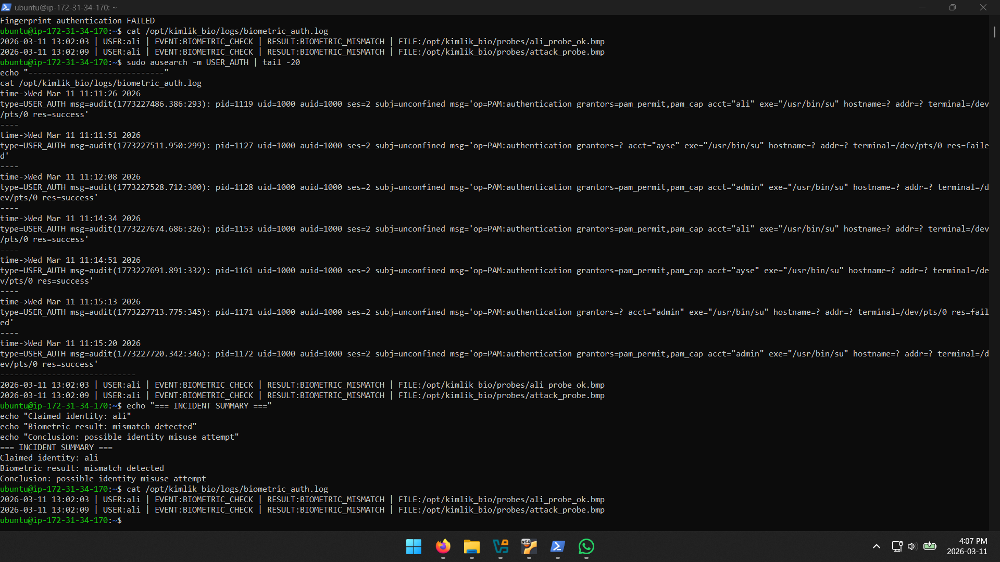

# Cloud Biometric Authentication & Digital Forensics Lab

## Overview

This project demonstrates a **cloud-based biometric authentication system simulation and digital forensic investigation workflow**.

The lab was built using **AWS EC2, Ubuntu Linux, auditd logging, and custom authentication scripts** to simulate biometric identity verification and security event analysis.

The goal of this project is to demonstrate:

- Identity authentication mechanisms
- Biometric verification simulation
- Security logging using auditd
- Digital forensic log investigation
- Cloud-based security lab deployment

---

# Architecture

The system architecture includes three main security components:

1. Identity Authentication  
2. Biometric Verification  
3. Digital Forensics Investigation  

Architecture Diagram:

---

# Technologies Used

- AWS EC2
- Ubuntu Linux
- SSH
- SCP
- auditd
- ausearch
- Linux user management
- Bash scripting

---

# System Setup

The lab environment was deployed on an **AWS EC2 instance running Ubuntu Linux**.

Key steps included:

- Cloud server deployment
- Secure SSH access configuration
- Linux environment verification

---

# Security Logging

Security logging was implemented using **auditd**, allowing monitoring of authentication activity.

Example monitored events:

- USER_LOGIN
- USER_AUTH
- authentication attempts

---

# Biometric Authentication Simulation

A simulated biometric system was implemented using:

- enrolled fingerprint samples
- probe fingerprint verification
- authentication comparison scripts

Project directory structure:

---

# Forensic Log Investigation

Authentication results were recorded in log files and analyzed using:

- ausearch
- audit log inspection

Example log result:

Claimed identity: **ali**  
Biometric result: **mismatch**

This indicates a **possible identity misuse attempt**.

---

# Key Learning Outcomes

This project demonstrates practical experience in:

- Cloud security environments
- Linux security monitoring
- Identity authentication workflows
- Biometric authentication concepts
- Digital forensic investigation
- Security log analysis

---

# Author

**Fakhr Aldin Alkhatib**  
Digital Forensics Student
